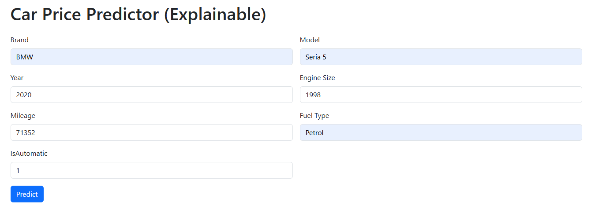
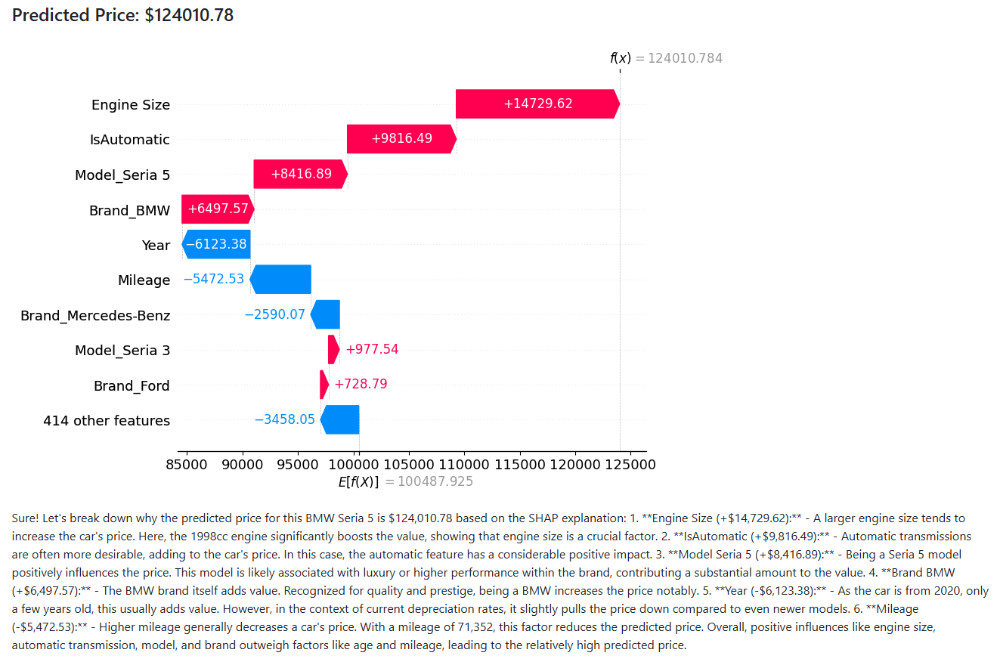

# Car Price Prediction with Explainable and Accurate AI

## Author: Viktor Kulyk

---

## Overview
This project is a complete machine learning pipeline for predicting used car prices. It combines classical models, deep learning, and explainability techniques. My goal was to build not only a high-performing predictor but also a system that can explain its decisions using GenAI (e.g., ChatGPT API).

I used real data scraped from [Otomoto.pl](https://www.otomoto.pl/) and built several models, including:
- Interpretable models like Gradient Boosting Regressor (GBR) with SHAP
- High-accuracy models like a stacked ensemble (GBR + 1D CNN)
- Deep learning architectures (FNN, 1D CNN)

The system supports practical deployment in a FastAPI app with future plans for a web-based UI and natural language explanations.

---

## Project Structure
```
├── data/                 # Raw and cleaned datasets
├── models/               # Saved models (GBR, CNN, stacked)
├── images/               # Images
├── README.md             # Project overview
```

---

## Data Collection
I scraped car listings from Otomoto.pl on 03/05/2025. Initial scraping was done using:
- `requests`, `httpx`, and `bs4` for fast HTML parsing
- Later switched to `selenium` in headless & stealth mode to bypass anti-bot protection

Collected ~3,700 listings with features such as:
- Brand, Model, Year
- Mileage, Fuel Type, Transmission
- Engine Size, Horsepower
- Color, Description, Price

---

## Data Preprocessing & Feature Engineering
- Cleaned numerical columns (`Mileage`, `Engine Size`, `Price`, etc.)
- Standardized inconsistent formats
- Translated Polish categorical values into English
- Grouped colors into `Light`, `Dark`, `Other`
- Converted `Transmission` to boolean: `IsAutomatic`
- Created `LogPrice` for log regression (used selectively)

---

## Exploratory Data Analysis (EDA)
- Examined feature distributions
- Detected skewness and outliers (via histograms and boxplots)
- Applied statistical tests (Shapiro-Wilk) to assess normality
- Investigated correlations with price
- Visualized price trends by brand, fuel type, color, year

---

## Machine Learning Models
I trained the following models and tuned their parameters:

### Gradient Boosting Regressor (GBR)
- Best interpretable model
- Compatible with SHAP for feature attribution

### CatBoost, XGBoost, Random Forest
- Tree-based models with good baseline performance

### Model Evaluation
| Model                | R²     | MAE     | RMSE    |
|---------------------|---------|---------|---------|
| Random Forest        | 0.8913  | 15,291  | 23,480  |
| CatBoost             | 0.8923  | 15,240  | 23,374  |
| XGBoost              | 0.9163  | 13,372  | 20,071  |
| Gradient Boosting    | 0.9188  | 13,041  | 19,775  |

---

## Deep Learning Models

### Feedforward Neural Network (FNN)
- Architecture: 128-64-1 with ReLU + dropout
- Trained with RMSLE loss
- R²: 0.81, MAE: ~16,000, RMSE: ~29,000

### 1D Convolutional Neural Network (CNN)
- Conv1D layers capture local feature interactions
- R²: 0.912, MAE: ~13,600, RMSE: ~20,600

---

## Stacked Model (GBR + CNN)
- Combined predictions from GBR and 1D CNN
- Trained meta-model (Linear Regression) on outputs
- Final metrics:
  - R²: ~0.925
  - MAE: ~13,000
  - RMSE: ~20,000

This model achieved the best tradeoff between accuracy and complexity.

---

## Explainability with SHAP
I used SHAP to explain GBR predictions:
- Performed global and local explanations
- Visualized why certain cars are priced higher/lower
- Example: SHAP showed `Year`, `Engine Size`, and `Brand` were key drivers

This supports transparent decision-making and can be extended into GenAI interfaces.

---

## Real Car Test Cases
Tested predictions for:
1. **Ford Focus (2015)**
   - Real Price: 42,900 PLN
   - GBR: 37,462 PLN
   - Stacked: 40,103 PLN

2. **BMW Seria 5 (2020)**
   - Real Price: 127,000 PLN
   - GBR: 124,011 PLN
   - Stacked: 136,457 PLN

SHAP explanations clearly showed feature contributions to the price.

---

##  Tech Stack
- Python, Pandas, Scikit-Learn, Keras, PyTorch, XGBoost, CatBoost etc.
- SHAP for explainability
- Matplotlib / Seaborn for visualization
- FastAPI

---

## Explainable Web Application

To bring this project into real-world usage, I created a lightweight and transparent **web application** that allows users to predict the price of a used car, interpret the prediction, and understand the reasoning behind it.

---

### How It Works

Users simply input key car attributes into a clean form interface:
- Brand (e.g., BMW)
- Model (e.g., Seria 5)
- Year (e.g., 2020)
- Mileage (e.g., 71,352 km)
- Engine Size (in cm³)
- Fuel Type
- Transmission (0 = Manual, 1 = Automatic)

After clicking **Predict**, the app instantly:
1. **Uses a trained Gradient Boosting Regressor model** to predict the car's price.
2. **Generates a SHAP plot** showing which features pushed the prediction up or down.
3. **Calls the ChatGPT API** to generate a friendly, readable explanation of the SHAP plot for non-technical users.

---

### Example: BMW Seria 5 (2020)



After submitting this input, the app returns a predicted price: **$124,010.78**  
Alongside it, a **SHAP waterfall plot** is displayed:



And finally, a **natural language explanation** is generated automatically:

> The price of this BMW is primarily driven up by the large engine size (+14,729), automatic transmission (+9,816), and the high-end model designation 'Seria 5' (+8,416). The BMW brand itself adds significant value (+6,497). Despite being from 2020, depreciation is slightly present (-6,123), and a relatively high mileage of 71,352 km also reduces the price slightly (-5,472). However, the positive influences outweigh the negatives, resulting in a high predicted price.

---

### Why It's Useful

This app goes beyond black-box predictions:
- It **builds trust** by showing users how the model reasons.
- It **empowers non-technical users** to understand machine learning outputs.
- It makes complex ML **transparent and accessible** through natural language and visual explanations.

---

This application is the final piece of my pipeline — bringing the work from data collection, modeling, and evaluation into a fully interactive and explainable AI product.

---

## How to Run the Web App Locally

To launch the explainable car price prediction web app on your machine, follow these steps:

---

### 1. Install the required dependencies

Make sure you have Python 3.9+ and the necessary libraries installed. Use:

```bash
pip install -r requirements.txt
```

---

### 2. Add your OpenAI API key

Create a `.env` file in the root directory and add your OpenAI key:

```env
OPENAI_API_KEY=your_api_key_here
```

This key is used to access the ChatGPT API for generating SHAP explanations in natural language.

---

### 3. Start the FastAPI backend

In the root directory, launch the backend server using:

```bash
uvicorn main:app --reload
```

This starts the FastAPI backend locally at: `http://127.0.0.1:8000`.

---

### 4. Open the frontend

Simply open `index.html` in your browser.  
Make sure the backend is running before submitting predictions.

---

Now you're ready to predict car prices, visualize SHAP plots, and receive real-time natural language explanations — all through an intuitive web interface.


## Contact
Have feedback or ideas? Reach out on GitHub or email me on [viktor.kulyk@hotmail.com](mailto:viktor.kulyk@hotmail.com)!

**
